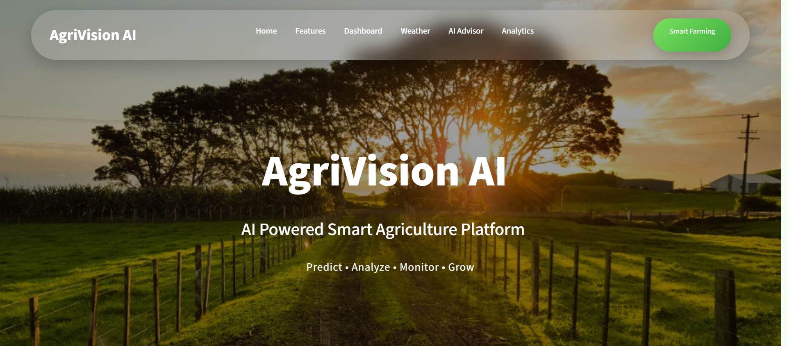
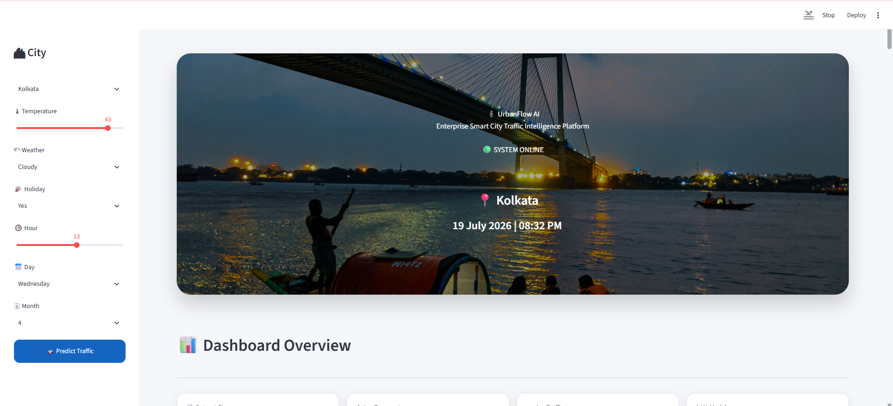

# 🎓 UpskillCampus Internship Projects

This repository contains the projects completed during my UpskillCampus Internship.

## 📂 Projects

### 🌾 AgriVisionAI
AI-powered Smart Agriculture Assistant built using:
- Python
- Streamlit
- Machine Learning
- AI Farming Advisor (Google Gemini API)
- Live Weather Forecast (OpenWeather API)
- Professional PDF Report Generator
- Downloadable Crop Reports
- State-wise Crop Analysis
- Crop Analytics Dashboard
- Production Trend Visualizations

📁 Folder: `AgriVisionAI`

---

### 📸 Project Preview

  

➡️ **Project Folder:** [`AgriVisionAI`](AgriVisionAI)

---

### 🚦 SmartCityTrafficForecasting
Traffic Forecasting Dashboard built using:
- Python
- Modern Streamlit UI
- Machine Learning Traffic Prediction
- Interactive Visualizations
- Historical Traffic Analysis
- Multiple City Support
- Dynamic City-based Dashboard Backgrounds
- Weather-aware Traffic Insights

📁 Folder: `SmartCityTrafficForecasting`

---

### 📸 Project Preview

  

➡️ **Project Folder:** [`SmartCityTrafficForecasting`](SmartCityTrafficForecasting)

---

## 📄 Project Reports

The internship reports are available in the **Reports** folder.

- AgriVisionAI_Report.pdf
- SmartCityTrafficForecasting_Report.pdf

---

## 👩‍💻 Developed By

**Maskeen Luthra**
